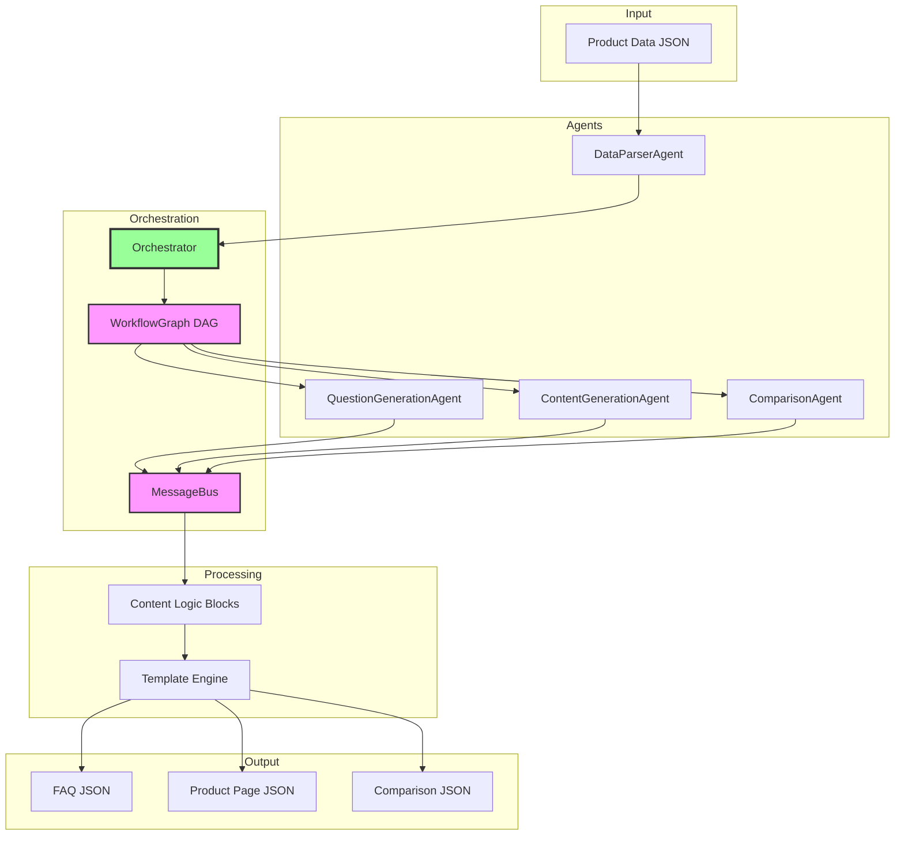
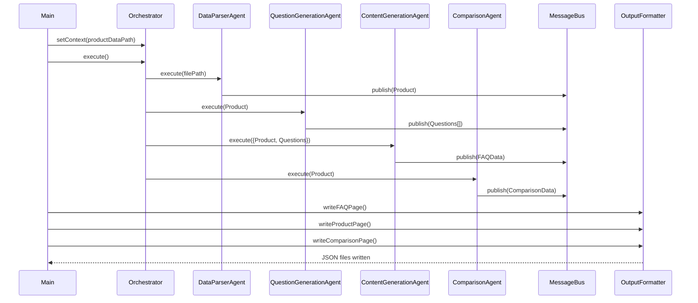

# Project Documentation

## Problem Statement

Transform a small product dataset (GlowBoost Vitamin C Serum) into structured, machine-readable content pages through an automated multi-agent system. The challenge evaluates the ability to design production-grade agentic workflows with:
- Multi-agent coordination
- Automation graphs with dependency management
- Reusable content logic
- Template-based generation
- Structured JSON output
- System abstraction and modularity

**Input**: Product data (name, ingredients, benefits, usage, pricing, etc.)  
**Output**: Three JSON pages - FAQ, Product Description, and Comparison

## Solution Overview

Built a modular multi-agent content generation system using a **coordinator-worker pattern** with **DAG-based orchestration**. The system processes product data through independent agents that communicate via a message bus, apply reusable logic blocks, and generate content using custom templates.

### Core Principles

1. **Agent Independence** - Each agent is a self-contained module with explicit dependencies
2. **Zero Global State** - All data flows through MessageBus
3. **Pure Logic Blocks** - Data transformation functions with no side effects
4. **Template-Driven Output** - Declarative templates define all output structures
5. **Type Safety** - Schema validation at multiple layers

## Scopes & Assumptions

### Scope

**In Scope:**
- Parse and validate product data
- Generate 15+ categorized questions automatically
- Create FAQ page (5+ Q&As)
- Create product description page
- Generate fictional competing product (Product B)
- Create comparison page
- Output all content as machine-readable JSON
- Full agent-based automation (no manual steps)

**Out of Scope:**
- UI/Frontend rendering
- External API integrations (besides OpenAI)
- Database persistence
- User authentication
- Real-time collaboration
- Multi-product batch processing

### Assumptions

1. **LLM Provider**: Uses OpenAI GPT-4 for intelligent content generation
2. **Data Format**: Product data provided as JSON with specific schema
3. **Fictional Product**: Product B is entirely generated by LLM, not researched externally
4. **Output Format**: JSON is sufficient (no HTML/CSS/React components required)
5. **Dependencies**: Node.js 18+ environment available
6. **API Access**: Valid OpenAI API key provided
7. **Language**: All content generated in English

## System Design

### Architecture Overview



### Component Details

#### 1. Data Layer

**`productModel.js`**
- Defines Product class with validation
- Provides `extractFacts()` for agent consumption
- Ensures data integrity throughout pipeline

**`DataParserAgent`**
- First agent in the pipeline (no dependencies)
- Reads product data from file or object
- Creates validated Product instance
- **Output**: Product object

#### 2. Agent System

**`BaseAgent` (Abstract Class)**
```javascript
interface BaseAgent {
  getName(): string
  getDependencies(): string[]
  validate(input): void
  execute(input): Promise<output>
  log(message): void
}
```

**Agent Dependency Graph:**
```
DataParserAgent (no deps)
    ├─→ QuestionGenerationAgent
    │       └─→ ContentGenerationAgent
    └─→ ComparisonAgent
```

**`QuestionGenerationAgent`**
- **Dependencies**: DataParserAgent
- **Input**: Product object
- **Process**: Uses LLM with structured prompts to generate diverse questions
- **Output**: Array of 15+ questions with categories
- **Categories**: Informational, Safety, Usage, Purchase, Comparison, Ingredients

**`ContentGenerationAgent`**
- **Dependencies**: QuestionGenerationAgent, DataParserAgent
- **Input**: Product + Questions
- **Process**: 
  - Selects 5 diverse questions for FAQ
  - Generates answers using LLM
  - Applies logic blocks for additional content
- **Output**: FAQ data with answers

**`ComparisonAgent`**
- **Dependencies**: DataParserAgent
- **Input**: Product A
- **Process**:
  - Generates fictional Product B via LLM
  - Applies comparison logic blocks
  - Creates recommendation
- **Output**: Comparison data structure

#### 3. Content Logic Blocks

Eight pure functions in `logicBlocks.js`:

| Block Name | Input | Output | Purpose |
|------------|-------|--------|---------|
| `extractBenefitsBlock` | Product | Benefits content | Format benefits with descriptions |
| `extractUsageBlock` | Product | Usage content | Create usage instructions |
| `generateSafetyBlock` | Product | Safety content | Safety info and precautions |
| `extractIngredientsBlock` | Product | Ingredients content | Ingredient analysis |
| `compareIngredientsBlock` | ProductA, ProductB | Comparison | Compare ingredients |
| `generatePriceComparisonBlock` | ProductA, ProductB | Comparison | Price analysis |
| `categorizeBenefitsBlock` | Product | Categorized benefits | Group benefits by type |
| `generateSkinTypeBlock` | Product | Skin type content | Suitability information |

**Characteristics:**
- Pure functions (no side effects)
- Composable and reusable
- Used by multiple agents
- Deterministic output

#### 4. Template Engine

**`TemplateSchema`**
- Defines template structure with field types
- Validates data against schema
- Specifies required logic blocks

**Template Definitions:**

```javascript
// FAQ Template
{
  name: 'faq_page',
  fields: [
    { key: 'pageTitle', type: 'string', required: true },
    { key: 'productName', type: 'string', required: true },
    { key: 'faqs', type: 'array', required: true }
  ],
  logicBlocks: ['extractBenefitsBlock', 'extractUsageBlock', 'generateSafetyBlock']
}

// Product Template
{
  name: 'product_page',
  fields: [
    { key: 'overview', type: 'object', required: true },
    { key: 'benefits', type: 'object', required: true },
    { key: 'ingredients', type: 'object', required: true }
    // ... more fields
  ],
  logicBlocks: ['extractBenefitsBlock', 'extractIngredientsBlock', ...]
}

// Comparison Template
{
  name: 'comparison_page',
  fields: [
    { key: 'productA', type: 'object', required: true },
    { key: 'productB', type: 'object', required: true },
    { key: 'comparison', type: 'object', required: true }
  ],
  logicBlocks: ['compareIngredientsBlock', 'generatePriceComparisonBlock']
}
```

**`TemplateEngine`**
- Registers templates
- Applies logic blocks to data
- Renders final structure
- Validates output

#### 5. Orchestration Layer

**`WorkflowGraph` (DAG Implementation)**
- Builds directed acyclic graph of agent dependencies
- Performs topological sort to determine execution order
- Detects circular dependencies
- Validates graph completeness

**Execution Order Computation:**
```
1. DataParserAgent (no dependencies)
2. QuestionGenerationAgent (depends on DataParser)
3. ContentGenerationAgent (depends on QuestionGeneration)
4. ComparisonAgent (depends on DataParser)
```

**`MessageBus`**
- Pub/sub pattern for agent results
- No shared state between agents
- Enables parallel execution where possible
- Result aggregation

**`Orchestrator`**
- Coordinates entire workflow
- Executes agents in dependency order
- Manages context and state
- Error handling and recovery
- Prepares agent-specific inputs

#### 6. LLM Integration

**`LLMService`**
- Wraps OpenAI API
- Provides `generateCompletion()` for text
- Provides `generateJSON()` for structured output
- Handles JSON parsing and validation
- Error recovery for malformed responses

**Prompt Engineering:**
- System prompts define agent expertise
- User prompts provide structured data
- Explicit JSON format requirements
- Temperature tuning (0.7 for content, 0.5 for JSON)

### Data Flow



### Extensibility

The system is designed for easy extension:

**Adding a New Agent:**
1. Extend `BaseAgent`
2. Implement `execute(input)`
3. Define dependencies
4. Register with Orchestrator

**Adding a New Logic Block:**
1. Create pure function `(data) => content`
2. Export from `logicBlocks.js`
3. Reference in template definitions

**Adding a New Template:**
1. Create `TemplateSchema` with fields
2. Specify required logic blocks
3. Register with `TemplateEngine`

**Adding a New Output Format:**
1. Create method in `OutputFormatter`
2. Call from main pipeline

### Quality Attributes

**Modularity**: Each component is independently testable and replaceable

**Maintainability**: Clear separation of concerns, consistent patterns

**Scalability**: DAG-based orchestration supports parallel execution

**Extensibility**: New agents, blocks, and templates can be added without modifying existing code

**Testability**: Pure functions, dependency injection, isolated components

**Reliability**: Validation at multiple layers, error handling throughout

---

## Technology Stack

- **Runtime**: Node.js 18+ (ES6 modules)
- **AI Integration**: OpenAI GPT-4
- **Architecture Pattern**: Coordinator-Worker with DAG
- **Communication**: Message Bus (Pub/Sub)
- **Testing**: Jest

## Key Design Decisions

1. **ES6 Modules**: Modern JavaScript with import/export for clean dependencies
2. **No Framework**: Pure Node.js to demonstrate system design skills
3. **DAG Orchestration**: Automatic dependency resolution vs. hard-coded sequences
4. **Message Bus**: Decouples agents from each other
5. **Pure Logic Blocks**: Functional approach for maximum reusability
6. **Schema Validation**: Type safety without TypeScript overhead
7. **LLM for Intelligence**: AI-powered question generation and content creation
